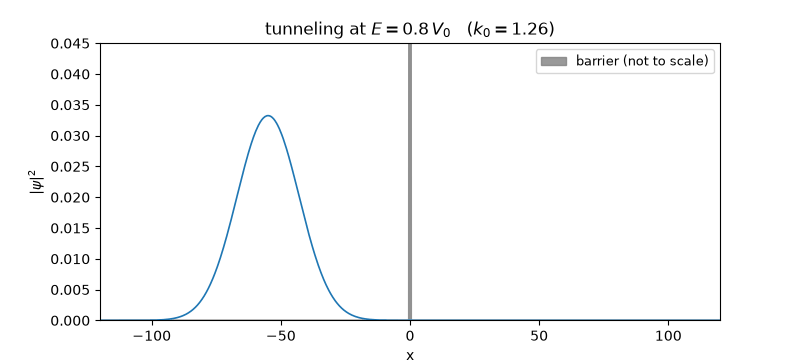

# splitop


**A split-operator Schrödinger solver where every test is a closed-form
quantum mechanics result.**



The Strang-split propagator `exp(-iVdt/2) exp(-iTdt) exp(-iVdt/2)` applies the
kinetic factor exactly in momentum space (FFT), making each step unitary by
construction. The same code with `t → -iτ` becomes an imaginary-time
ground-state solver. Natural units ħ = m = 1.

What the test suite demands (no fixture data, no self-consistency shortcuts —
analytic QM only):

| test | analytic ground truth |
|---|---|
| norm after 2,000 steps | 1 within 1e-12 (unitarity) |
| energy drift over 5,000 steps | < 1e-8 relative |
| coherent state in a harmonic well | center follows the classical `x₀ cos ωt` |
| free Gaussian packet | width obeys `σ(t) = σ₀√(1+(t/2σ₀²)²)` |
| imaginary-time relaxation | finds `E₀ = ω/2` and the exact Gaussian width `1/√(2ω)` |
| wavepacket at a square barrier | transmitted probability matches the exact plane-wave `T(E)` for E below *and* above the barrier |

The barrier test is the interesting one: a wavepacket is not a plane wave, so
it only converges to the textbook `T(E)` when its momentum spread is narrow
(`σ = 30` → `Δk/k₀ ≈ 1%`) and the domain is large enough that the packet
clears the barrier before touching the periodic boundary. Getting that test
to pass at 2% tolerance pins down the propagator, the momentum grid
convention, and the observable code simultaneously.

## Install & use

```bash
pip install -e ".[dev]"
```

```python
import numpy as np
from splitop import Grid, evolve, gaussian_packet, harmonic

grid = Grid(-40, 40, 2048)
psi = gaussian_packet(grid, x0=-5, k0=2.0, sigma=1.0)
psi = evolve(psi, harmonic(grid, omega=0.7), grid, dt=0.005, n_steps=2000)
print(grid.expectation_x(psi), grid.energy(psi, harmonic(grid, omega=0.7)))
```

Regenerate the animation: `python examples/tunneling.py`.

## Tests

```bash
pytest -q     # 10 analytic-QM validations
ruff check .
```

## License

MIT
